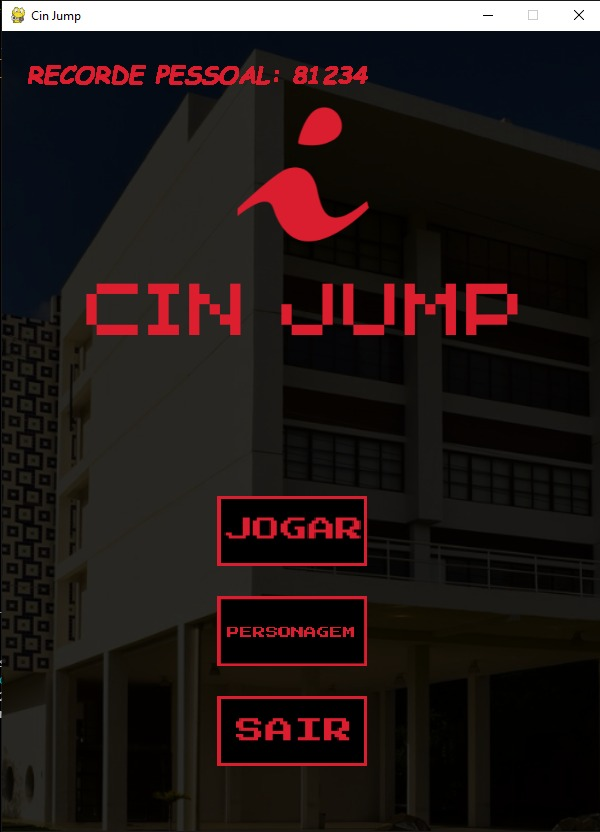
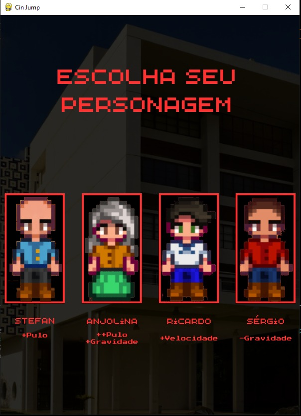
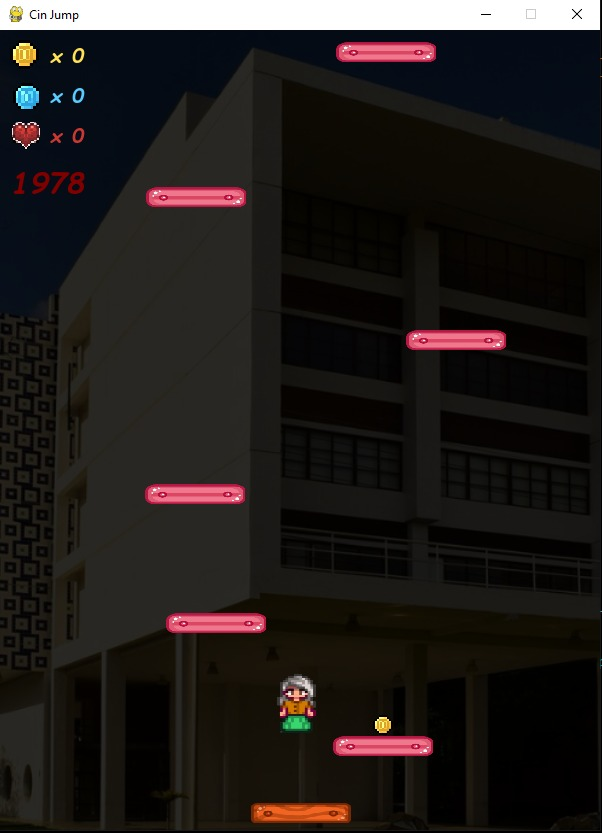
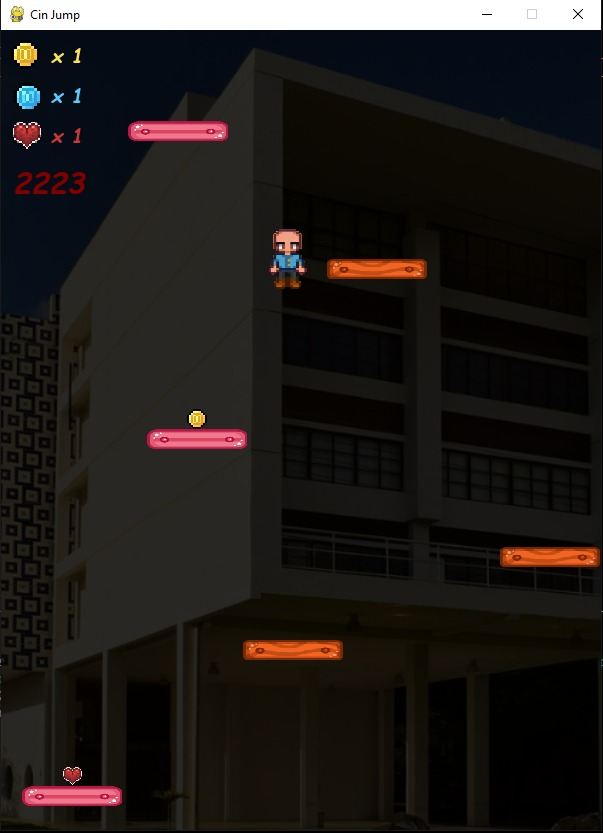
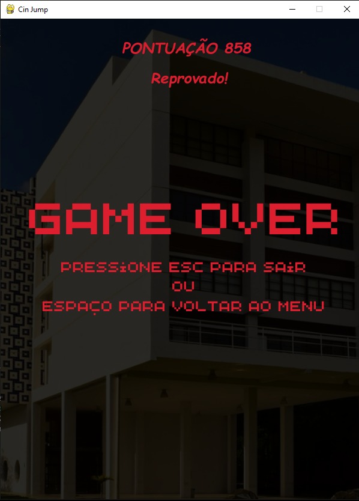

<h1>CIn Jump</h1>

Grupo: 
Ruan Alexandre Ferreira da Silva <rafs2> 
Guilherme Vinícius Nigro Braga <gvnb> 
Elisson Dias de Oliveira <edo> 
Guilherme José da Silva <gjs> 
Arthur Rocha Campos <arc> 
Vitor Lacerda <vll>

Sobre o jogo:

<ul>
	<li>Jogo criado como um projeto final da cadeira de Introdução à Programação do curso de Ciência da Computação da UFPE.</li>
	<li>Inspirado no clássico Doodle Jump, o jogo consiste em pular em plataformas verticais infinitas para conseguir a maior pontuação, só que com alguns elementos do Centro de Informática.</li>
	<li>
		É possível encontrar as seguintes mecânicas no jogo:
		<ul>
			<li>
				4 personagens selecionáveis, cada um diferentes mecânicas:
				<ul>
					<li>Stefan: Pulo mais alto</li>
					<li>Anjolina: Pulo muito mais alto, porém com uma gravidade maior</li>
					<li>Ricardo: Maior velocidade lateral</li>
					<li>Sérgio: Gravidade menor</li>
				</ul>
			</li>
			<li>
				3 coletáveis diferentes e que influenciam na jogabilidade:
				<ul>
					<li>Moedas: + 100 pontos</li>
					<li>Diamantes: +500 pontos</li>
					<li>Vidas: Faz com que o jogador sobreviva ao cair fora do mapa</li>
				</ul>
			</li>
			<li>
				4 tipos de plataformas com diferentes funcionalidades:
				<ul>
					<li>Madeira normal: plataforma sem nenhuma especialidade</li>
					<li>Madeira vermelha: Quebra após pular nela</li>
					<li>Madeira com movimento: plataforma que se movimenta e que possui 6 níveis de velocidade.</li>
					<li>Madeira com mola: possui uma mola que aumenta a distância do pulo após o contato</li>
				</ul>
			</li>
			<li>
				Pontuação recorde pessoal (funciona apenas com o jogo aberto)
			</li>
			<li>
				Mensagens de classificação dependendo da sua pontuação final 
			</li>
			</li>
			<li>
				Níveis de dificuldade discretos que variam dependendo de sua pontuação atual
			</li>
		</ul>
	</li>
</ul>

Requisitos:
Algum local que rode python (Vscode ou Pycharm, por exemplo)
Ter a biblioteca “pygame” instalada (preferencialmente, a última versão)

	Como jogar:
Baixe o repositório no seu PC
Abra o diretório x no seu compilador de preferência
Execute o arquivo “main.py”

Controles:
Setinhas para esquerda e direita ou A e D para movimentar o personagem para, respectivamente, esquerda ou direita
Cursor do mouse para selecionar os botões.
	Screenshots do Jogo:

</img>
</img>
</img>
</img>
</img>

Arquitetura do Projeto:

O modo como os arquivos e pastas foram organizados está listado acima, onde as setas representam a ordem import em que nós colocamos um arquivo dentro de outro.
As pastas onde foram salvas as fotos e áudios utilizados no jogo são representados pelo balão “imagens e sons utilizados nos jogos” que no repositório correspondem às pastas imagens e pela pasta sounds.
os arquivos usados na imagem também estão inclusos em uma pasta com o nome códigos, sendo os arquivos: 
“sprites.py” - esse sendo o arquivo que transforma as imagens e sons mostrados no item anterior em variáveis e armazena seu valor, além de formatá-las para um formato específico. 
“classes.py” - nesse arquivo é onde temos as definições das classes que serão usadas no jogo, sendo elas plataforma e itens, além da classe Button.
“player.py” - é o arquivo onde criamos a classe do player que é o personagem jogável, ele é o responsável por interagir com as plataforma e itens, além dos controles do personagem
“game_logic.py” - é onde nós colocamos as funções que geram as plataformas e itens, incluindo também as funções que atualizam o mapa dependendo da interação do jogador com o mapa, além do funcionamento principal do jogo. 
“jogo.py” - Aqui é onde a lógica central do jogo está, há variáveis globais que mantêm o estado do jogo entre os loops. As funções principais incluem o menu principal, a seleção de personagem e a tela de game over. A função principal, chamada “main()”, inicializa o jogo configurando o fundo, gerando plataformas e itens, posicionando o jogador, e iniciando o loop do jogo, em que são registrados os coletáveis, pontuação, além do funcionamento do jogo.
“main.py” - Tem como função apenas chamar o arquivo “jogo.py” já que ele ficou muito grande, desse jeito o único arquivo que o jogador precisa abrir para rodar o jogo tem 5 linhas.

Ferramentas, bibliotecas e Frameworks
As seguintes ferramentas foram utilizadas:
Vscode: Principal IDE utilizada no desenvolvimento
Canvas: Utilizado para criar as imagens das diferentes telas do jogo
Whatsapp: Principal canal de comunicação da equipe
Discord: Canal de comunicação para falar com os monitores responsáveis do projeto 
Playlist de vídeos “Pygame - Jumpy” do canal do youtube “Coding With Russ”, vídeos que ajudaram a programar nosso jogo, com ideias e soluções para algumas funcionalidades do jogo.
As seguintes bibliotecas foram utilizadas:
Pygame como biblioteca principal para a construção do jogo e suas funcionalidades, como a movimentação, a posição das plataformas, colisão entre plataformas, entre outros aspectos, além do design do jogo, com a possibilidade de carregar imagens para cada elemento do jogo.
Sys para fechar o jogo de maneira correta com a função “sys.exit()”.
Biblioteca Random para dar uma aleatoriedade no jogo, como a geração aleatória dos tipos de plataformas, o espaçamento entre as plataformas subsequentes e a geração dos tipos de itens

Divisão de Trabalho

Inicialmente, possuía um plano fixo para a divisão de trabalho, entretanto, ao decorrer do projeto, as funções de cada integrante não foram fixas com o decorrer do projeto e acabou que cada integrante ficou responsável por algo a mais. 
Aqui está o que cada integrante acabou realizando:
Guilherme Braga:
Criação inicial da movimentação do personagem
Elisson Oliveira e Guilherme José:
Funcionalidade geral do jogo, como classes, loop principal, geração de mapa, etc.
Organização do código após junção das partes

Arthur Rocha e Vitor Lacerda
Design, como seleção de sprites, imagens e sons do jogo
Transição de telas entre o jogo
Ruan Alexandre
Criação de slides e do relatório do github
Conselhos e revisão na parte de movimentação do personagem em conjunto com Guilherme Braga

Todos revisaram os slides e a descrição do git antes de publica-lá
Todos participaram diretamente ou indiretamente dos ajustes e correções de bugs

Conceitos utilizados

Listas
Utilizado para armazenar plataformas e itens do mapa
Dicionários
Utilizado para armazenar informações, como tuplas e listas
Condicionais
Utilizado para diversas situações, como a seleção de personagens, armazenar os coletáveis, etc.
Laços de repetição
Utilizado “for”s para acessar conteúdos das listas e dicionários, além do “while” para o loop do jogo
Funções
Facilitar sequências de códigos que são reutilizados ou passar para outras telas
Classes
Orientação de objetos, como a movimentação, funcionalidades das plataformas, itens e botões
 

Desafios e Erros

Pergunta 1°
“Qual foi o maior erro cometido durante o projeto? Como vocês lidaram com ele?”

Resposta:

A geração das plataformas, quando chegava na metade/final do limite determinado da lista de plataformas, as plataformas subsequentes ficavam mais espaçadas do que o normal e que os itens não estavam sendo gerados corretamente em cima da plataforma, ficando espalhado pelo mapa. Após pedir ajuda dos monitores e ninguém apresentar uma solução plausível até que em certo momento Arthur se lembrou de ter retirado uma parte do código de uma função para colocá-lo dentro do loop principal, tentamos isso e deu certo, não sabemos o exato motivo do porque, mas funcionou.
Pergunta 2°
Qual foi o maior desafio enfrentado durante o projeto? Como vocês lidaram com ele?
Resposta:
Resolver bugs foi definitivamente o maior desafio, devido a nossa inexperiência com o pygame entender onde exatamente havia os erros foi mais complicado que quando mexemos com python normal, para lidar com isso bastou estudar mais sobre a linguagem, pedir ajuda aos monitores, conversar entre si e revisar o código juntos.

Pergunta 3°
“Quais as lições aprendidas durante o projeto?”

Resposta:

Aprendemos a mexer com o pygame, que pode funcionar como uma base para aprender outras linguagens de desenvolvimento de jogos, aprendemos a trabalhar em um projeto em equipe, dividir tarefas entre si, se ajudar. Tudo isso nos dá experiência para o futuro no mercado de trabalho e em projetos pessoais de python e pygame.
